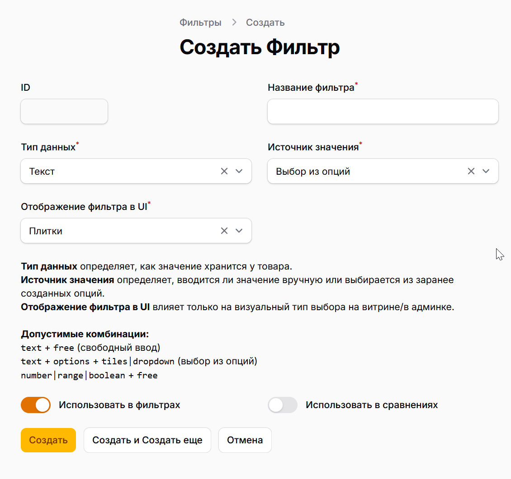

+++
title = 'Фильтры'
date = 2026-02-21T08:31:06+03:00
+++

# Фильтры

Этот раздел нужен для настройки характеристик товаров, которые участвуют в фильтрации, сравнении и отображении на карточке.

## 1. Где находится раздел

В админ-панели работа с фильтрами проходит в двух местах:

1. `Фильтры → Фильтры` — создание и редактирование самих фильтров.
2. `Список категорий → выбрать категорию → Фильтры используемые в категории` — подключение фильтров к конкретной категории и настройка отображения.

## 2. Что важно понять до начала

1. Один фильтр можно использовать в нескольких категориях.
2. Самое важное решение при создании фильтра — правильно выбрать `Тип данных`.
3. Если выбрали `Текст + Выбор из опций`, нужно обязательно заполнить список опций.
4. Для `Число` и `Диапазон` единицы измерения должны быть заранее заведены в разделе `Единицы измерения`. Как правило там уже введены все основные [единицы измерения](../units/) и их семейства.

## 3. Поля при создании или изменении фильтра

### 3.1 Название фильтра

Человекочитаемое имя фильтра, например: `Мощность`, `Производительность`, `Тип двигателя`.

### 3.2 Тип данных

Варианты:

1. `Текст`
2. `Число`
3. `Диапазон`
4. `Да / Нет`

### 3.3 Источник значения

Определяет, как будут вводиться данные:

1. `Свободный ввод`
2. `Выбор из опций`

Важно:

1. `Выбор из опций` доступен только для текстовых фильтров.
2. Для `Число`, `Диапазон` и `Да/Нет` используется только `Свободный ввод`.

### 3.4 Отображение фильтра в UI

Доступно только для комбинации `Текст + Выбор из опций`:

1. `Плитки`
2. `Выпадающий список`

### 3.5 Переключатели

1. `Использовать в фильтрах` — фильтр появляется в фильтрации.
2. `Использовать в сравнениях` — фильтр участвует в сравнении товаров.

### 3.6 Единицы измерения (для числа и диапазона)

Поля показываются только для `Число` и `Диапазон`:

1. `Измерение (семейство единиц)`
2. `Единица измерения по умолчанию`
3. `Дополнительные единицы`

### 3.7 Числовой формат (для числа и диапазона)

1. `Знаков после запятой`
2. `Шаг значений`
3. `Округление`

## 4. Как создать фильтр (типовой сценарий)

1. Откройте `Фильтры → Фильтры`.
2. Нажмите `Создать`.
3. Заполните `Название фильтра`.
4. Выберите `Тип данных`.
5. Выберите `Источник значения`.
6. Если это `Текст + Выбор из опций`, укажите `Отображение фильтра в UI`.
7. Если это `Число`/`Диапазон`, выберите измерение и единицы.
8. При необходимости задайте `Знаков после запятой`, `Шаг`, `Округление`.
9. Включите нужные переключатели (`в фильтрах`, `в сравнениях`).
10. Сохраните фильтр.

## 5. Что делать после сохранения

### 5.1 Добавить опции (если фильтр с выбором из опций)

1. Откройте вкладку `Опции доступные для использования`.
2. Добавьте варианты значений и выставьте порядок.

### 5.2 Привязать категории

Можно сделать двумя способами:

1. В фильтре: вкладка `Категории (использование)` → `Привязать категорию`.
2. В категории: `Фильтры используемые в категории` → `Добавить`.

В категории дополнительно можно настроить:

1. `Единицу отображения` для этой категории.
2. Локальные параметры числа (`знаков после запятой`, `шаг`, `округление`).
3. Видимость в карточке товара и сравнении.

## 6. Как фильтр заполняется у товаров

1. `Текст + Свободный ввод` — вводится строка.
2. `Текст + Выбор из опций` — выбираются заранее созданные опции.
3. `Число` — вводится одно числовое значение.
4. `Диапазон` — вводятся `Мин.` и `Макс.`.
5. `Да / Нет` — переключатель.

## 7. Частые ошибки

### 7.1 Неправильный тип данных

Если выбрать `Текст` вместо `Число`, фильтры и ввод значений будут работать не так, как ожидается.

### 7.2 Для фильтра с опциями не добавлены сами опции

Фильтр есть, но выбрать пользователю будет нечего.

### 7.3 Для числа/диапазона не настроены единицы

Появляются проблемы с отображением и сравнением числовых значений.

### 7.4 Фильтр создан, но не привязан к категориям

Фильтр не появится там, где ожидается, пока не будет добавлен в категорию.

## 8. Короткий чек-лист перед запуском в работу

1. Тип данных выбран корректно.
2. Для текстовых фильтров с опциями заполнен список опций.
3. Для числовых фильтров выбраны правильные единицы измерения.
4. Фильтр привязан к нужным категориям.
5. Проверены видимость и настройки сравнения.
