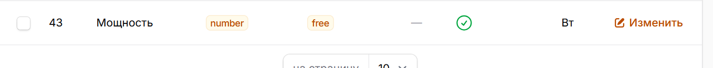
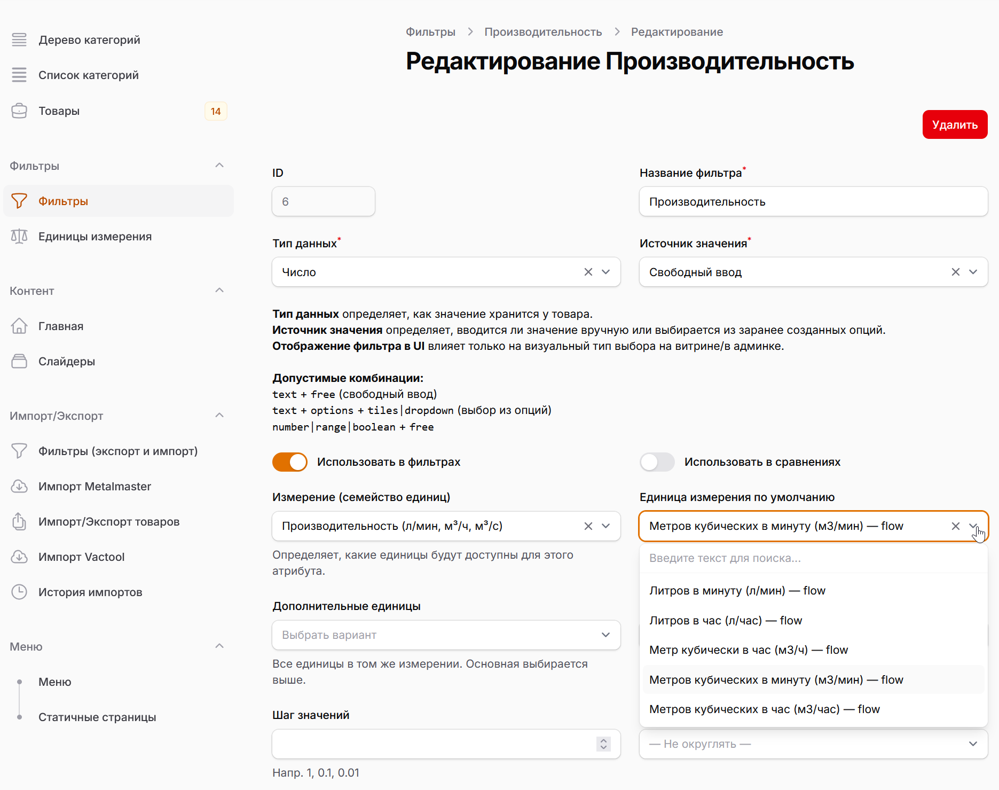
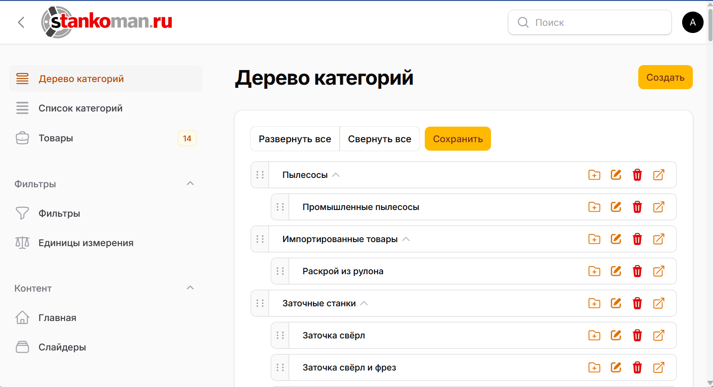

+++
title = 'Единицы измерения'
date = 2026-02-20T08:31:06+03:00
+++

# Единицы измерения

## Зачем они нужны

Единицы измерения нужны, чтобы на сайте характеристики товаров отображались понятно и одинаково:

- с правильным обозначением: `мм, кВт, бар, л/мин`

- в правильном виде для фильтров (например, чтобы фильтр “`от 10 до 50`” работал корректно, даже если где-то значения в `л/мин`, а где-то в `м³/ч`)

Если единицы настроены верно — характеристики красиво показываются и фильтры работают предсказуемо.

## Где это в админке

* **Фильтры → Единицы измерения** — список всех единиц измерения (Units) и их создание. По умолчанию уже созданы все основные еденицы измерения и их семейства.
* **Фильтры → Выбрать фильтр** — Кнопка "Изменить" и далее выбирается “единица по умолчанию” для конкретного фильтра.

* В привязке **Категория ↔ атрибут**  можно выбрать **Eдиницу отображения** (единицу отображения именно для этой категории).

## Простыми словами: что такое “Единица измерения” в системе

Это карточка, которая отвечает на вопросы:

1. **Как называется единица?** (например “Бар”)
2. **Какой символ показывать на сайте?** (`бар`)
3. **К какому типу величины относится?** (давление, длина, расход…)
4. **Как системе сравнивать/фильтровать значения правильно?** (для этого нужен коэффициент пересчёта)

------

## Как добавить новую единицу

### Шаг 1. Создай единицу

Нажми **Создать** и заполни:

### 1) Название

Как в списке будет называться единица.

- Пример: `Миллиметр`, `Бар`, `Литров в минуту`

### 2) Обозначение (символ)

Что будет показываться рядом с числом на сайте.

- Пример: `мм`, `bar/бар`, `л/мин`, `м³/ч`

### 3) Тип величины

Выбирай смысловую группу:

- длина / давление / мощность / расход / скорость / температура и т.д.

Это важно: **единицы из разных типов нельзя смешивать**.

### 4) Базовая единица (внутренняя)

Это “главная” единица внутри системы для этого типа величины.
 Она нужна, чтобы фильтры сравнивали всё в одном формате.

Ты обычно выбираешь из готового списка. Примеры:

- давление → базовая `Pa`
- расход → базовая `m³/s`
- длина → базовая `m`

### 5) Коэффициент пересчёта

Самое важное поле. Оно говорит системе: **сколько “базовых единиц” содержится в 1 твоей единице**.

Примеры (готовые, просто бери):

- `мм → m` : коэффициент `0.001`
- `см → m` : `0.01`
- `кПа → Pa` : `1000`
- `МПа → Pa` : `1000000`
- `бар → Pa` : `100000`
- `м³/ч → m³/s` : `0.000277777778` (то есть 1/3600)
- `л/мин → m³/s` : `0.000016666667` (это 0.001/60)

> Если сомневаешься: открой любой конвертер величин и посмотри “сколько базовых единиц в 1 штуке”.
>  Например: “1 bar = 100000 Pa” → значит коэффициент `100000`.

------

## Как использовать единицу дальше (типовой сценарий)

### 1) Создали единицу измерения

Например: `л/мин`

### 2) В атрибуте выбрали эту единицу

Открой **Фильтры** → нужный фильтр (например “Производительность”) → выбери единицу по умолчанию.

Далее:

Теперь:
- на карточке товара и в характеристиках появится правильный символ,
- значения будут храниться и фильтроваться корректно.

### 3) (Опционально) Для конкретной категории можно выбрать другую “единицу отображения” в рамках семейства

Это нужно, если один и тот же атрибут в разных категориях удобнее показывать по-разному.

Пример:

- где-то удобно `м³/ч`
- а где-то людям привычнее `л/мин`

Тогда в настройках связи “категория ↔ атрибут” выбирается единица отображения для этой категории.

------

## Частые ошибки

### Ошибка 1: Неправильный тип величины

Например, случайно выбрать “скорость” вместо “расход”.
 Итог: единицы не будут доступны там, где нужно, или фильтры начнут вести себя странно.

### Ошибка 2: Неправильный коэффициент

Итог: числа на сайте могут выглядеть “нормально”, но **фильтры будут отбирать неверные товары**.

### Ошибка 3: Символ неудобный для пользователя

Например `m3/h` вместо `м³/ч`.
 Символ лучше делать “как в техдоках” — это повышает доверие.

------

## Температура (важный нюанс)

Для температур иногда нужен не только коэффициент, но и **смещение** (например °C → K).
 В текущей админской форме смещение может быть недоступно для редактирования — тогда лучше:

- либо не заводить температуры через этот механизм,
- либо попросить разработчика добавить “расширенное поле” для температур.

------

## Мини-шпаргалка коэффициентов

- `мм → м` : `0.001`
- `см → м` : `0.01`
- `кВт → Вт` : `1000`
- `бар → Па` : `100000`
- `м³/ч → м³/с` : `0.000277777778`
- `л/мин → м³/с` : `0.000016666667`
